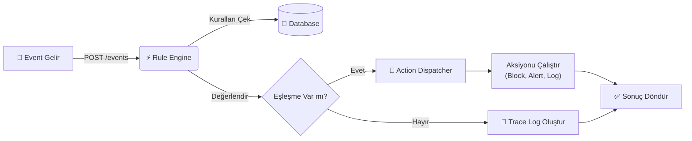

# ⚡️ Java Event-Driven Rule Engine

<div align="center">


**Dinamik, Güvenli ve Yüksek Performanslı Kural Motoru**

[Özellikler](#-özellikler) • [Mimari](#-mimari) • [Kurulum](#-kurulum-ve-çalıştırma) • [API Dokümantasyonu](#-api-kullanımı)

</div>

---

## 📖 Proje Hakkında

**Java Event-Driven Rule Engine**, iş mantığını kodun içinden çıkarıp dinamik bir yapıya kavuşturan modern bir mikro-framework'tür. Geleneksel `if-else` bloklarının karmaşasından kurtulun; kurallarınızı JSON ile tanımlayın, veritabanında saklayın ve anlık olarak yönetin.

> **💡 Neden Kullanmalıyım?**
> *   Kod deploy etmeden kural değiştirme
> *   İş birimlerinin anlayabileceği basit JSON yapısı
> *   "Neden bu karar verildi?" sorusuna yanıt veren **Traceability**
> *   Production-ready güvenlik önlemleri

---

## 💎 Özellikler

| Özellik | Açıklama |
| :--- | :--- |
| **🚀 Dinamik Kurallar** | Kurallar REST API üzerinden runtime'da eklenir/silinir. Kod değişikliği gerekmez. |
| **🔍 Derin İzlenebilirlik** | Kural motoru karar verirken hangi adımda, neden başarısız olduğunu raporlar. |
| **💾 Kalıcılık (Persistence)** | H2 Database ve Spring Data JPA ile kurallar diskte veya bellekte güvenle saklanır. |
| **🛡️ Güvenlik (Secure)** | ReDoS koruması, Strict Input Validation ve güvenli hata yönetimi ile saldırılara karşı dayanıklı. |
| **🧩 Zengin Operatörler** | Regex, Tarih, Liste ve Nested Object (iç içe veri) desteği. |

---

## 🏗 Mimari

Sistem, olay tabanlı (event-driven) bir yaklaşımla çalışır.



---

## 🚀 Kurulum ve Çalıştırma

### Gereksinimler
*   Java 17 veya üzeri
*   Maven 3.6+

### Adım Adım Başlangıç

1.  **Projeyi Klonlayın**
    ```bash
    git clone https://github.com/your-username/java-rule-engine.git && cd java-rule-engine
    ```

2.  **Testleri Çalıştırın** (Güvenli kod ve logic kontrolü için)
    ```bash
    mvn test
    ```

3.  **Uygulamayı Başlatın**
    ```bash
    mvn spring-boot:run
    ```

📌 **Erişim Bilgileri:**
*   API: `http://localhost:8080/api`
*   H2 Console: `http://localhost:8080/h2-console`
    *   *JDBC URL:* `jdbc:h2:mem:ruleengine`
    *   *User:* `SA`

---

## 📡 API Kullanımı

### 1️⃣ Kural Ekleme
Sisteme yeni bir iş kuralı tanımlayın.

`POST /rules`

```json
{
  "name": "HighRiskTransaction",
  "priority": 1,
  "description": "Riskli kullanıcıların yüksek tutarlı işlemlerini engelle",
  "when": {
    "all": [
      { "field": "amount", "op": ">", "value": 1000 },
      { "field": "user.trustScore", "op": "<", "value": 50 }
    ]
  },
  "then": {
    "action": "BLOCK_USER",
    "message": "Security alert: High risk transaction detected."
  }
}
```

### 2️⃣ Event Değerlendirme
Motorun bir olayı işlemesini sağlayın.

`POST /events`

```json
{
  "type": "PAYMENT",
  "payload": {
    "amount": 2500,
    "user": {
      "id": "usr_99",
      "trustScore": 10
    }
  }
}
```

#### ✅ Başarılı Yanıt (Trace Özelliği İle)
Motor, hangi kuralın çalıştığını ve çalışmayanların neden elendiğini detaylıca döner.

```json
{
  "success": true,
  "matchedRules": ["HighRiskTransaction"],
  "actions": ["BLOCK_USER"],
  "trace": [
    {
      "ruleName": "HighRiskTransaction",
      "matched": true,
      "failureReason": null
    }
  ]
}
```

---

## 🔧 Desteklenen Operatörler

| Operatör | Anlamı | Örnek |
| :--- | :--- | :--- |
| `==`, `!=` | Eşitlik / Eşitsizlik | `role == "ADMIN"` |
| `>`, `>=`, `<`, `<=` | Sayısal/Tarihsel Karşılaştırma | `age >= 18` |
| `contains` | İçerme (String/List) | `title contains "Error"` |
| `startsWith`, `endsWith` | Başlangıç/Bitiş Kontrolü | `email endsWith "@company.com"` |
| `matches` | **Regex** Kontrolü | `phone matches "^\\+90\\d{10}$"` |
| `in` | Liste İçinde Var mı? | `status in ["ACTIVE", "PENDING"]` |
| `dateBefore`, `dateAfter` | Tarih Kontrolü | `expiryDate dateAfter "2024-01-01"` |

---

## 🔒 Güvenlik (Security Hardening)

`Security Implementation Plan` kapsamında aşağıdaki önlemler alınmıştır:

*   🛡 **ReDoS Protection**: `ConditionEvaluator` regex işlemleri sırasında input uzunluğunu (Max 1000 chars) denetler. Regex bomb saldırılarını engeller.
*   🛡 **Strict Validation**: Kural isimleri (`@Pattern`) ve açıklamalar sınırlandırılmıştır. XSS ve Injection riskleri minimize edilmiştir.
*   🛡 **Information Hiding**: 500 hatalarında stack trace ve internal class yapıları dışarı sızdırılmaz.

---

<div align="center">

**Made with ❤️ by Harun Isik**

</div>
